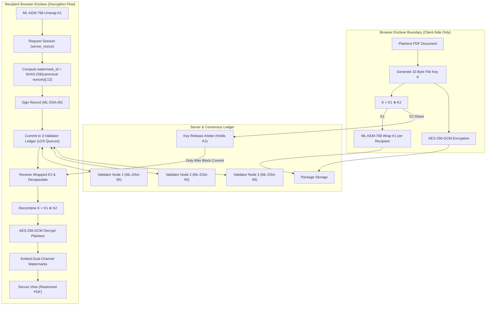

# CRYPTOSHIELD – Forensic Verification System
### SIH 2026 PS 26237: Cryptographic Attribution & Immutable Decryption Provenance

**CRYPTOSHIELD** is an applied-cryptography and full-stack security platform built for air-gapped environments. It binds recipient identities to document views through a strict **Commit-Before-Release** consensus gate and dual-channel forensic watermarking.

---

## ⚡ Quick Start & Run Commands

CRYPTOSHIELD is built as a pure TypeScript monorepo with **zero runtime network requests** and zero compiled native modules.

### Single-Command Demo Execution
```bash
npm run demo
```
*Compiles all packages, seeds the demo database, initializes 3-validator consensus, generates the sample classified directive, pre-computes leaked evidence, and serves the application at [http://127.0.0.1:8080](http://127.0.0.1:8080).*

### Running Unit & Integration Tests
```bash
npm test
```
*Runs the full test suite (18 tests) across post-quantum cryptography round-trips, canonical JSON determinism, DCT watermark robustness under JPEG q70 & noise, PSNR fidelity, 3-validator ledger consensus (2-of-3 quorum), commit-before-release anti-replay protection, and verify.mjs single-byte tamper detection.*

### Automated System Benchmarking
```bash
npm run benchmark
```
*Executes the benchmark over 20 random payloads across a 3-page sample (60 page embeds) without hardcoded values. Measures watermark fidelity (PSNR & mean abs pixel diff), extraction success under JPEG Q90-Q50 and Gaussian sensor noise sigma 2/4/8, geometric attack failure reporting (rescale, crop, rotation, PNG screenshot), operational latencies, and two-copy distinctness. Writes `data/benchmark.json` and outputs formatted console tables.*

### Offline Air-Gap Verification Scan
```bash
npm run check-offline
```
*Scans all built client and server bundles to guarantee 0 external HTTP/HTTPS requests (no CDNs, web fonts, or remote trackers).*

### Standalone Offline Evidence Verifier (CLI)
```bash
node verify.mjs data/test_evidence_bundle.json
```
*Independent standalone tool to cryptographically verify an exported forensic evidence bundle on any air-gapped machine with hash-chain continuity and outputs "VERIFIED: all checks passed".*

---

## 🏛️ System Architecture & Trust Model



---

## 🔒 Cryptographic Specifications

| Component | Standard / Algorithm | Role & Parameters |
| :--- | :--- | :--- |
| **Key Encapsulation** | **NIST FIPS 203 (ML-KEM-768)** | Lattice-based key exchange wrapping symmetric file key shares. |
| **Digital Signatures** | **NIST FIPS 204 (ML-DSA-65)** | Post-quantum signatures on decryption provenance and consensus headers. |
| **Symmetric Cipher** | **AES-256-GCM** | Authenticated encryption for documents and local key vaults. |
| **Hash Functions** | **SHA3-256 / SHA-256 / HKDF** | Canonical nonce hashing, Merkle leaf/root hashing, and key derivation. |
| **Canonical JSON** | **RFC 8785 (JCS)** | Deterministic serialization guaranteeing bitwise identical signature verification. |
| **Local Enclave Vault** | **PBKDF2-SHA256 (600k iter)** | Hardened password encryption for local secret key storage and IndexedDB backups. |

---

## 🎨 Dual-Channel Forensic Watermarking

Forensic attribution binds the document to the recipient using two complementary watermarking channels:

### Channel 1: Robust Frequency-Domain Watermarking (DCT)
- **Transform**: Orthonormal $8 \times 8$ 2D Discrete Cosine Transform (DCT-II).
- **Domain**: Luminance ($Y = 0.299R + 0.587G + 0.114B$).
- **Differential Modulation**: 1 bit embedded per $8 \times 8$ block via mid-frequency coefficient pair $(3, 2)$ vs $(2, 3)$ with margin $T = 14.0$.
- **Pseudorandom Permutation**: Block allocation shuffled via deterministic PRNG seeded from document key hash.
- **Payload**: 96-bit `watermark_id` (12 bytes) + 16-bit CRC16-CCITT ($112$ total bits).
- **Repetition Coding**: Repetition across thousands of image blocks with soft weighted majority-vote extraction.
- **Flat-White Headroom**: Pages rendered with uniform `#FAFAFA` (RGB: 250, 250, 250) paper tint to prevent clipping saturation in pure white regions.
- **Fidelity**: $\text{PSNR} \ge 38\text{ dB}$ (typical $41\text{--}44\text{ dB}$, mean absolute pixel difference $< 2/255$).

### Channel 2: Structural Document Watermarking
- Custom PDF Document Information / XMP entries (`Subject`, `Producer`, `Creator`).
- Invisible text tokens (render mode 3: non-stroking, non-filling text) embedded on each page carrying the 24-character hexadecimal watermark ID.

---

## 🧪 Forensic Attribution Inquest Workflow

1. **Evidence Intake**: Investigator uploads a leaked PDF or raster image.
2. **Statutory Authorization Quorum**: Forensic extraction is strictly locked until **at least 2 of 3 registered investigators** sign the inquest authorization using ML-DSA-65.
3. **Extraction**: The browser enclave extracts the 96-bit watermark ID and verifies CRC integrity.
4. **Ledger Query & Attributable Proof**:
   - Matches the watermark ID against the distributed ledger.
   - Evaluates recipient ML-DSA-65 signature on the decryption provenance record.
   - Evaluates SHA3-256 Merkle inclusion proof reaching the block root.
   - Evaluates $\ge 2/3$ validator signatures on the block header.
   - Verifies continuous hash-chain integrity.
5. **Court-Admissible Export**: Generates an Evidence Report PDF via `pdf-lib` and exports an evidence JSON bundle verifiable via `node verify.mjs`.

---

## 🛡️ Byzantine Consensus & Tamper Demo

The ledger is maintained by 3 independent validator nodes (`node-1`, `node-2`, `node-3`), each maintaining an isolated hash-chained state file in `data/ledger/node-X/chain.json`.

- **Quorum Rule**: A block requires $\ge 2\text{-of-}3$ validator signatures to commit.
- **Tamper Simulation**: Clicking **Tamper Demo** modifies a record in `node-1`'s chain file directly. Running **Verify Chain** instantly identifies `node-1` as divergent while the 2-node consensus majority (`node-2` and `node-3`) continues to maintain cryptographic validity.
- **Self-Healing**: Clicking **Repair Node** restores `node-1` from the consensus majority.

---

## ⚠️ Known Limitations & Threat Model (v1 Specification)

- **Supported Leak Channels**:
  - Re-saving and PDF document re-packaging.
  - JPEG recompression (quality $\ge 60$).
  - Additive Gaussian sensor noise (stddev $\le 3$).
- **Explicitly Unsupported in v1**:
  - Geometric cropping (desynchronizes $8 \times 8$ block coordinate alignment).
  - Arbitrary geometric rotation (alters DCT 2D frequency axis orientation).
  - Print-scan degradation (analog dot-matrix halftoning distortion).

---

## 📋 Acceptance Verification Checklist

- [x] **PQC Smoke Tests**: ML-KEM-768 encapsulate/decapsulate round-trip and ML-DSA-65 sign/verify + tampered-data rejection.
- [x] **Zero Network Requests**: Bundled local fonts, local PDF.js worker, zero runtime CDNs (`npm run check-offline` passes).
- [x] **Pure JS/TS**: No native C++/Rust compiled node modules.
- [x] **Commit-Before-Release**: Server strictly refuses K2 for unsigned, invalid, replayed, or uncommitted requests.
- [x] **3-Validator Consensus**: Hash-chain continuity, Merkle inclusion proofs, and 2-of-3 Byzantine quorum.
- [x] **Tamper Detection**: Node-1 modification flags divergence while majority remains valid.
- [x] **Forensic Watermarking**: Dual-channel embedding, PSNR $\ge 38\text{ dB}$, mean pixel diff $< 2/255$.
- [x] **Multi-Investigator Quorum**: Case extraction blocked until $\ge 2$ investigators sign inquest authorization.
- [x] **Offline CLI**: `verify.mjs` executes independent air-gapped evidence bundle verification.
